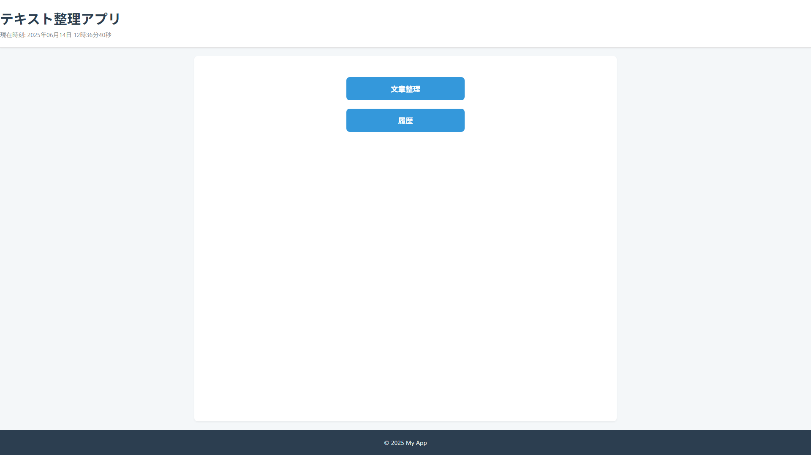
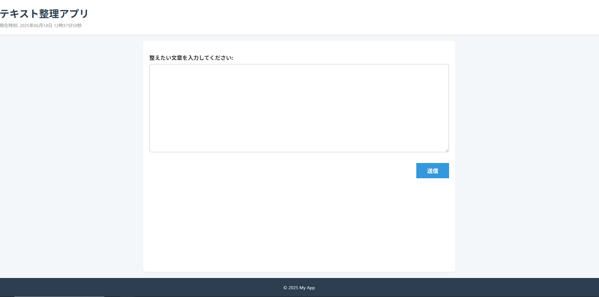
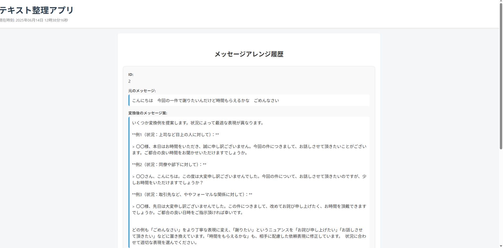

# Message_arrange                                      

## 概要
送信したメッセージをビジネスシーンで使える丁寧な言葉に変換してくれる

## 主な機能
- Home画面

- メッセージ送信

- メッセージ履歴


## 使用技術

- Python / Django（バックエンド）
- SQLite（データベース）
- HTML / CSS（フロントエンド）

##苦労、工夫した点

- 初めてAPIを活用したので利用規約などをきちんと読んだ
- APIを使用するための流れをつかむのが大変だった

## AI活用について  
開発にあたって、AIを活用して以下の支援を受けました。

- CSSなどのレイアウト
- エラーの原因特定と解決方法の提案  

## 起動方法（開発環境）
```bash
git clone https://github.com/daigo-jp/message_arrange
cd myproject
python manage.py migrate
python manage.py runserver
